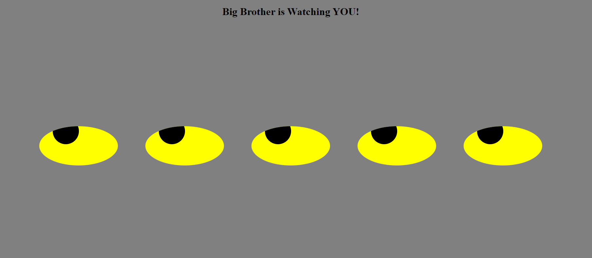

# EyeRoll Proof of Concept 
Creates 5 Eyes and Eye Ball on Browser Screen that move with mouse movement
<!--Expanded upon by Philip Case based on an MIT XPro class exercise June 2022-->

<h2>How to Run</h2>

1. Open index.html file in web browser
2.  Move the mouse and watch the eyeballs roll with the mouse movement
3. Look over your shoulder - someone is WATCHING you!
4. This program includes the use of HTML, CSS and Javascript
5. The Document Object Model DOM is utilized for the Eyes and Eye balls

<h2>Roadmap Run:</h2>

1. Add spooky background soundtrack
2. A timmer sequence where the eyes disappear, and then reappear in a different screen location
3. Add Eyebrows
4.  Use computer cam to track and follow head and eye movement of user - they have the screen eyeballs follow - rather than mouse on move

<h2>License Discolures:</h2>
MIT License
